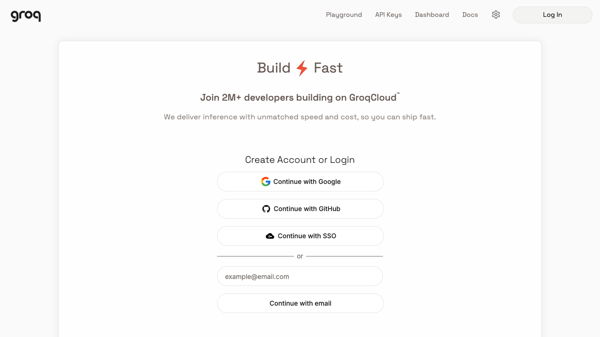
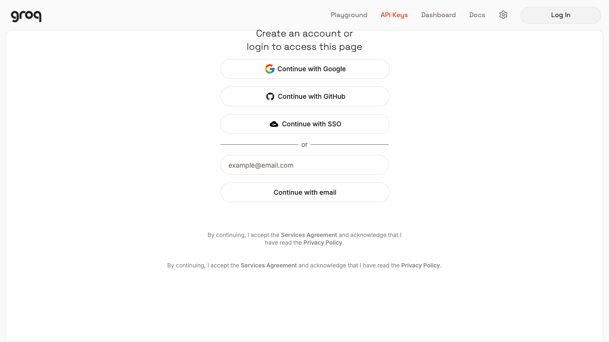
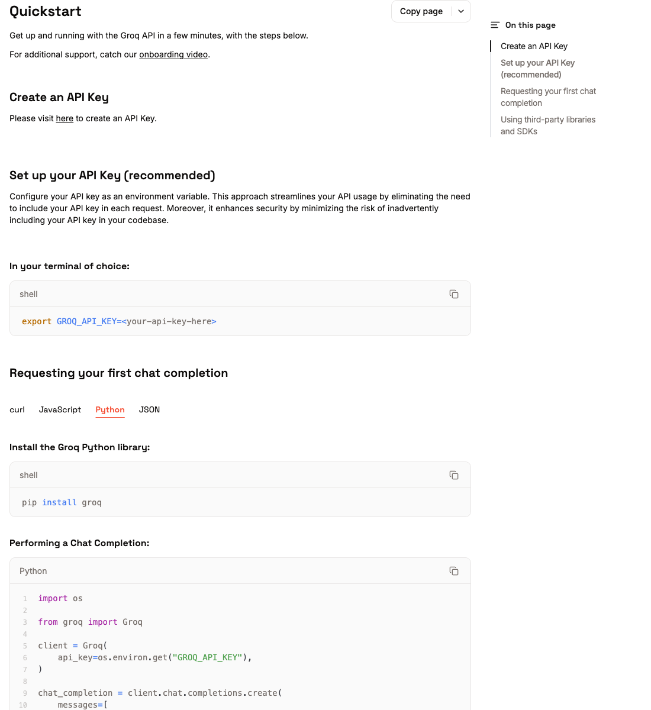
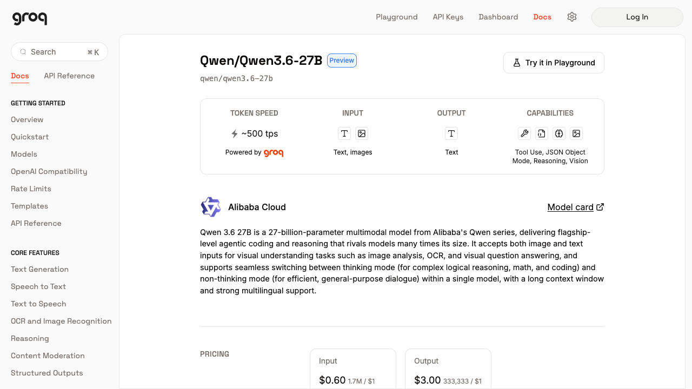
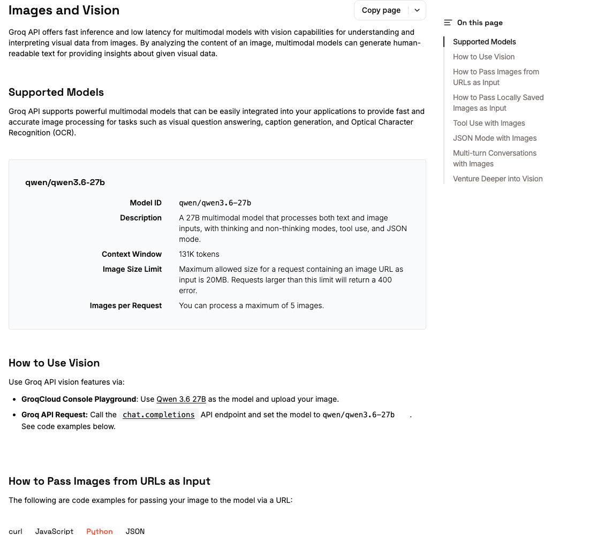

# 免费获取 Groq API Key，并用 Qwen3.6-27B 识图

[English](groq-qwen3.6-vision.md) | **中文**

这篇教程完成两件事：

1. 注册 GroqCloud 的 Free Plan，并创建一个 Groq API Key。
2. 在 DSH Vision Toolkit 或普通代码中调用 `qwen/qwen3.6-27b` 分析图片。

> 截至 2026-08-17，Groq 官方模型页将 Qwen3.6-27B 标记为 Preview，支持文本和图片输入。Free Plan 有速率和每日额度限制，具体数值可能调整，请以 [Groq Rate Limits](https://console.groq.com/docs/rate-limits) 和 [Qwen3.6-27B 模型页](https://console.groq.com/docs/model/qwen/qwen3.6-27b) 为准。

## 1. 注册免费的 GroqCloud 账号

打开 [GroqCloud Console](https://console.groq.com/)。可以使用 Google、GitHub、SSO 或邮箱注册/登录。

<p align="center">
  
</p>

完成注册后即可先使用 Free Plan，不需要为本教程购买付费额度。免费额度不是无限量服务；超出当前限制时，接口会返回 `429 Too Many Requests`。

截至 2026-08-17，官方 Free Plan 表中 Qwen3.6-27B 的基础限制为 `30 RPM`（每分钟请求数）、`1K RPD`（每日请求数）、`8K TPM`（每分钟 Token 数）和 `200K TPD`（每日 Token 数）。账号的实际限制以 Groq Console 的 Limits 页面为准。

## 2. 创建并保存 API Key

登录后打开顶部的 **API Keys**，或直接访问 [Groq API Keys](https://console.groq.com/keys)。未登录时会先看到下面的登录页面：

<p align="center">
  
</p>

在 API Keys 页面中：

1. 点击 **Create API Key**。
2. 给密钥填写一个容易辨认的名称，例如 `dsh-vision-toolkit`。
3. 确认创建。
4. 立即复制以 `gsk_` 开头的密钥，并保存到密码管理器或 DSH Credential 中。

Groq 官方 Quickstart 也把“创建 API Key”和“通过环境变量保存密钥”放在最前面：

<p align="center">
  
</p>

API Key 通常只在创建后完整显示一次。不要把它粘贴到 README、聊天记录、截图、Git 提交或前端代码中。

### 在终端中设置密钥

macOS / Linux：

```sh
export GROQ_API_KEY="gsk_your_key_here"
```

Windows PowerShell（只对当前窗口生效）：

```powershell
$env:GROQ_API_KEY = "gsk_your_key_here"
```

确认变量已经存在，但不要打印完整密钥：

```sh
test -n "$GROQ_API_KEY" && echo "GROQ_API_KEY is set"
```

## 3. 确认模型名和视觉能力

Groq API 中必须使用完整模型 ID：

```text
qwen/qwen3.6-27b
```

不要写成 `qwen3.6-27b`、`Qwen3.6-27B` 或只写 `27b`。模型页会同时显示图片输入和 Vision 能力：

<p align="center">
  
</p>

Groq 模型页列出的主要图片限制是：

| 项目 | 限制 |
|---|---:|
| 单个图片文件 | 最大 20 MB |
| 单次请求图片数 | 最多 3 张 |

Groq 的通用视觉文档当前写的是最多 5 张图片，但 Qwen3.6-27B 的模型专页写的是最多 3 张。这里按模型专页的更严格限制执行，避免请求被拒绝。

<p align="center">
  
</p>

## 4. 在 DSH Vision Toolkit 中使用

如果已经安装本插件，这是最短路径。

1. 打开 DSH Web 的 **设置 → 视觉工具**。
2. 在“视觉服务”中填写：

| 字段 | 值 |
|---|---|
| API 协议 | `OpenAI Chat Completions` |
| 服务地址 | `https://api.groq.com/openai/v1` |
| 模型名称 | `qwen/qwen3.6-27b` |
| API 密钥 | 粘贴刚创建的 `gsk_...` 密钥 |

3. 点击 **保存并应用**。密钥会保存到 DSH Credentials，设置页面以后不会回显完整内容。
4. 点击 **测试视觉模型**。这个按钮会发送插件自带的诊断图片，验证的是真实多模态请求，而不只是 `/models` 连通性。
5. 测试成功后，新建或继续一个会话，粘贴图片并直接提问，例如：

```text
看一下这张截图，先完整抄出报错信息，再解释最可能的原因。
```

也可以在 Profile patch 中配置相同的提供方。密钥本身仍应由 DSH Credential 或环境变量提供，不要写进 YAML：

```yaml
- id: vision-toolkit
  config:
    provider:
      protocol: openai
      baseUrl: https://api.groq.com/openai/v1
      model: qwen/qwen3.6-27b
      credential: GROQ_API_KEY
```

## 5. 用 cURL 直接识别网络图片

下面的请求使用 Groq 的 OpenAI Chat Completions 兼容接口。把示例图片 URL 换成你自己的公开图片地址：

```sh
curl https://api.groq.com/openai/v1/chat/completions \
  -H "Authorization: Bearer $GROQ_API_KEY" \
  -H "Content-Type: application/json" \
  -d '{
    "model": "qwen/qwen3.6-27b",
    "messages": [{
      "role": "user",
      "content": [
        {"type": "text", "text": "请描述图片中的主要内容，并逐字抄出可见文字。"},
        {"type": "image_url", "image_url": {
          "url": "https://upload.wikimedia.org/wikipedia/commons/f/f2/LPU-v1-die.jpg"
        }}
      ]
    }],
    "temperature": 0.2,
    "max_completion_tokens": 1024
  }'
```

成功后，模型回答位于 `choices[0].message.content`。

## 6. 用 Python 识别本地图片

下面的例子读取本地图片并转换成 Base64 Data URL。推荐使用 `uv` 临时安装 Groq SDK，不污染系统 Python：

```python
# recognize.py
import base64
import mimetypes
from pathlib import Path

from groq import Groq

image_path = Path("screenshot.png")
mime_type = mimetypes.guess_type(image_path.name)[0] or "image/png"
image_base64 = base64.b64encode(image_path.read_bytes()).decode("ascii")
data_url = f"data:{mime_type};base64,{image_base64}"

client = Groq()  # 自动读取 GROQ_API_KEY
response = client.chat.completions.create(
    model="qwen/qwen3.6-27b",
    messages=[{
        "role": "user",
        "content": [
            {"type": "text", "text": "分析这张截图：先做 OCR，再指出最重要的异常。"},
            {"type": "image_url", "image_url": {"url": data_url}},
        ],
    }],
    temperature=0.2,
    max_completion_tokens=1024,
)

print(response.choices[0].message.content)
```

运行：

```sh
uv run --with groq python recognize.py
```

Base64 会让请求体积比原文件更大。如果请求接近 20 MB 上限，请先缩小或压缩图片，或者改用模型能够访问的 HTTPS 图片 URL。

## 7. 常见问题

### `401 Invalid API Key`

- 确认复制的是完整的 `gsk_...` 密钥。
- 环境变量中不要包含多余空格、引号内容或换行。
- 如果密钥曾经出现在公开位置，删除旧密钥并重新创建。

### `404` 或 `model not found`

- 模型名必须是 `qwen/qwen3.6-27b`。
- 该模型目前属于 Preview；如果 Groq 后续调整可用性，请查看官方模型页和 Groq Console 中当前可选模型。

### `413` 或图片过大

- Base64 图片限制比 URL 图片严格；先缩小尺寸或压缩质量。
- 不要把大量图片塞进一个请求；按 Qwen3.6-27B 模型专页的限制，单次最多 3 张。

### `429 Too Many Requests`

- Free Plan 已达到分钟、Token 或每日限制。
- 查看响应头中的速率限制信息，等待额度恢复后重试。

### 模型只描述图片，没有回答重点

把任务写具体，例如：

```text
不要泛泛描述。请只完成三件事：
1. 逐字抄出红色错误框里的文字；
2. 返回错误框在原图中的大致位置；
3. 根据界面上下文判断最可能的原因。
```

## 官方资料

- [Groq Quickstart](https://console.groq.com/docs/quickstart)
- [Groq API Keys](https://console.groq.com/keys)
- [Qwen3.6-27B 模型页](https://console.groq.com/docs/model/qwen/qwen3.6-27b)
- [Groq Images and Vision](https://console.groq.com/docs/vision)
- [Groq Rate Limits](https://console.groq.com/docs/rate-limits)
